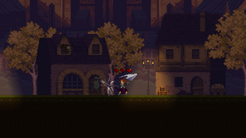
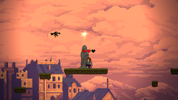
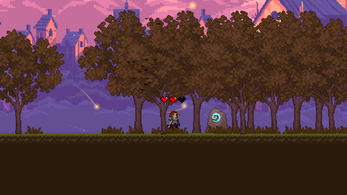
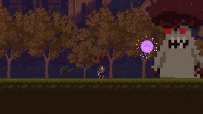

# Holy Knight

A fast-paced 2D action-platformer built for the **H-BRS Game Jam 2023**, where it placed **3rd out of 8 entries**.

Beat the evil Mushroom King and restore light to a world drowning in shadow.

  

## Built in 10 Days

Made from **August 3–12, 2023** - built solo in 10 days.

## About

The Mushroom King has drained the world of its light using shadow magic. As the Holy Knight, you must fight through skeletons and shadow-flyers, solve light-based puzzles, and take down the King in a final boss fight to bring light back to the world.

  
  

## Controls

| Action | Key |
|---|---|
| Walk | A / D |
| Jump | Space |
| Wall jump (once) | Space |
| Wall-corner pull up | Space |
| Dash (also mid-air) | Shift |
| Attack (also mid-air/dash) | Left Mouse |
| Break boxes | Attack |
| Activate statue | E |
| Finish level (runestone) | E |
| Pick up key | E |
| Open magic wall (needs keys) | E |
| Pick up heart | Walk over it |
| Restart current level | Esc |

## Enemies

- **Skeletons** - Can't be killed; their only weakness is light.
- **Blackflyers** - Stunned by attacking (their light disappears briefly). Vulnerable to bright light from statues, shown by black particles indicating invulnerability windows. Red light = attacking, blue light = not attacking.
- **Brownflyers** - Disable street lights. Can be stunned for a few seconds by attacking. Street lights re-enable if no brownflyers have been nearby for a while.

## Boss Fight

The Mushroom King channels shadow energy to darken the world and summons minions to aid him. Reflect his orbs by timing your attacks to weaken him and restore the light.

  

## Play

- Platform: Windows
- Clone this repo, then run `SL-GK.exe` inside the build folder.

## About the Jam

Made for the first official **H-BRS Game Jam**, hosted by H-BRS Game Dev and Againstyou, running August 3–6, 2023. Entries had to creatively incorporate a theme announced at the start of the jam.

Jam page: [itch.io/jam/hbrs-game-jam](https://itch.io/jam/hbrs-game-jam)
